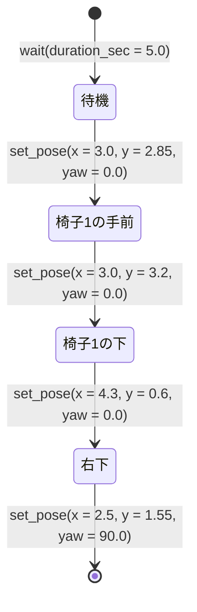

# シミュレーション用デモ
スタート(0.5, 0.5)から、クレーターを避けて椅子の下を通り(サンプルの上を通過)、ゴール(中央のコーンの手前)へ向かう。
座標は地図の左下が原点、x 0〜5m、y 0〜4m、yaw は度。椅子の位置は config/map/course.yaml と合わせる。

```mermaid
stateDiagram-v2

[*] --> 待機 : wait(duration_sec = 5.0)
待機 --> 椅子1の手前 : set_pose(x = 3.0, y = 2.85, yaw = 0.0)
椅子1の手前 --> 椅子1の下 : set_pose(x = 3.0, y = 3.2, yaw = 0.0)
椅子1の下 --> 右下 : set_pose(x = 4.3, y = 0.6, yaw = 0.0)
右下 --> [*] : set_pose(x = 2.5, y = 1.55, yaw = 90.0)
```
